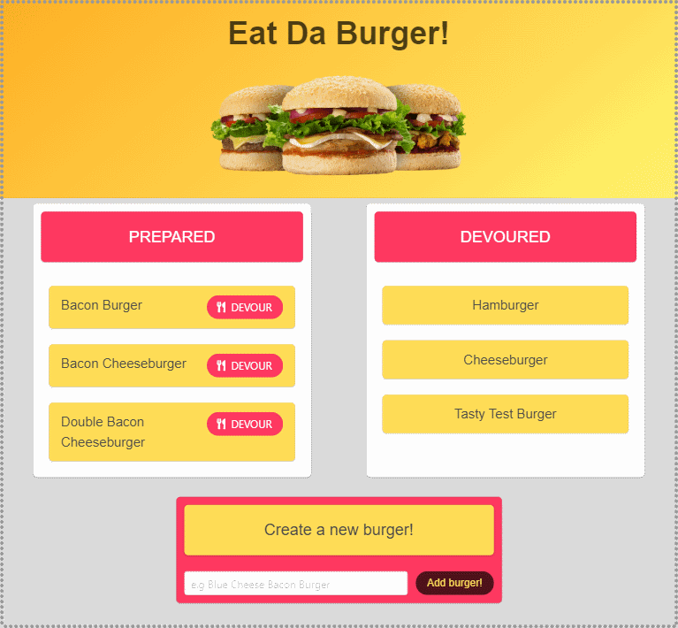

# Eat Da Burger!



___
## This is an updated burger app. The original used personally made ORM and MySQL controllers.
## This is updated to use sequelized to handle MySQL information better.

### Simple app using express to run an api that talks to MySQL database. Vue is used as the front end then Axios is used to get, post, and put to the API.

#### User can click the devour button to "eat" a burger from the prepared list. Burgers are then placed in the devoured section once eaten. If no burgers are available then the user can create a new burger.

##### Go to http://tbl-sequel-burger.herokuapp.com/ to try it out.
___
### Tech used:
```
JavaScript
Node
NPM
Express
Vue
Axios
MySQL2
Sequelized
```

# sequelizedBurger
